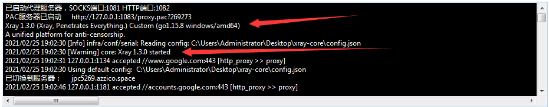
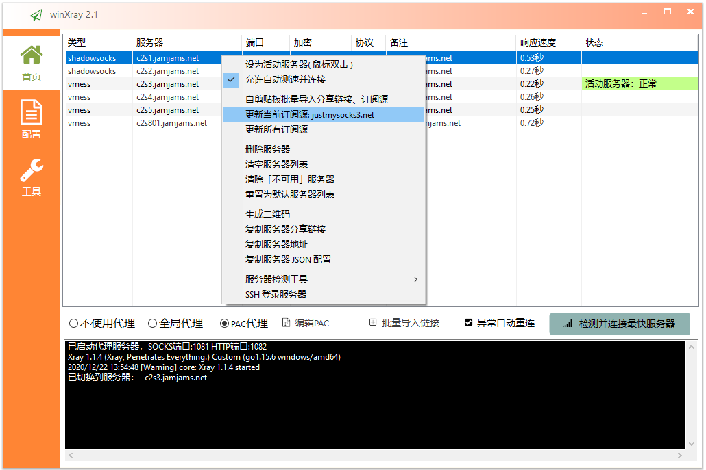
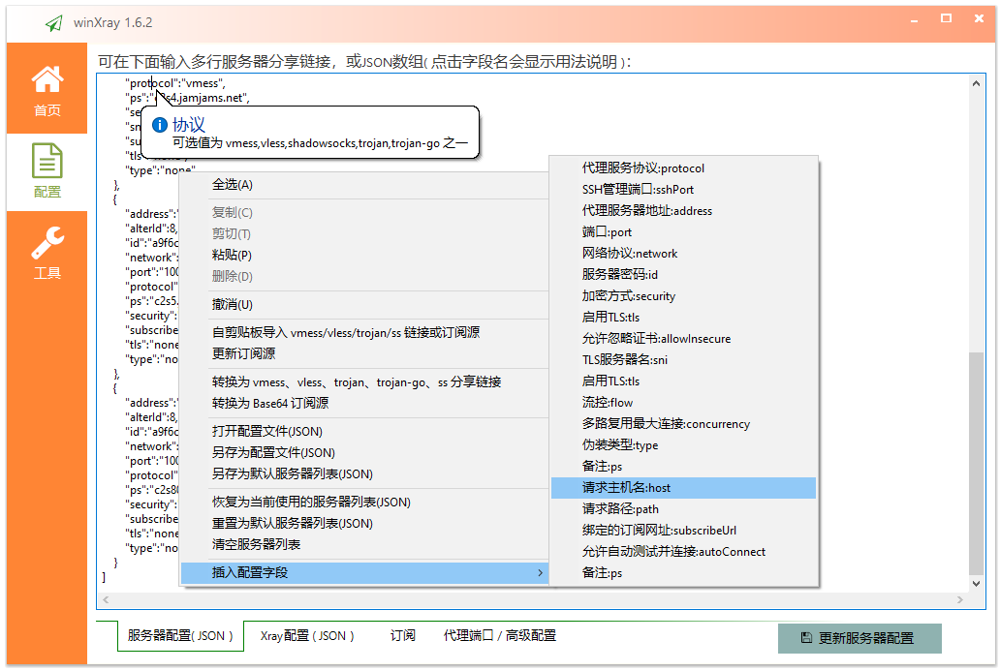
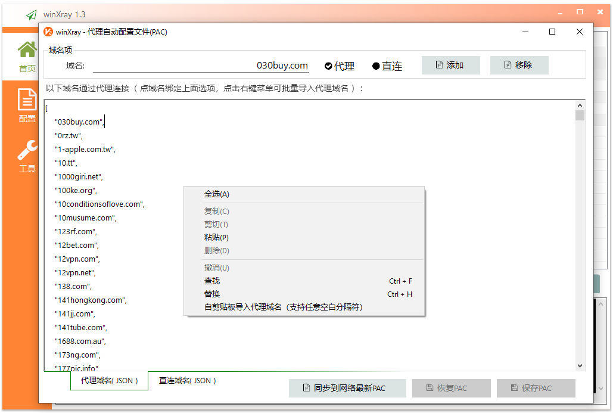
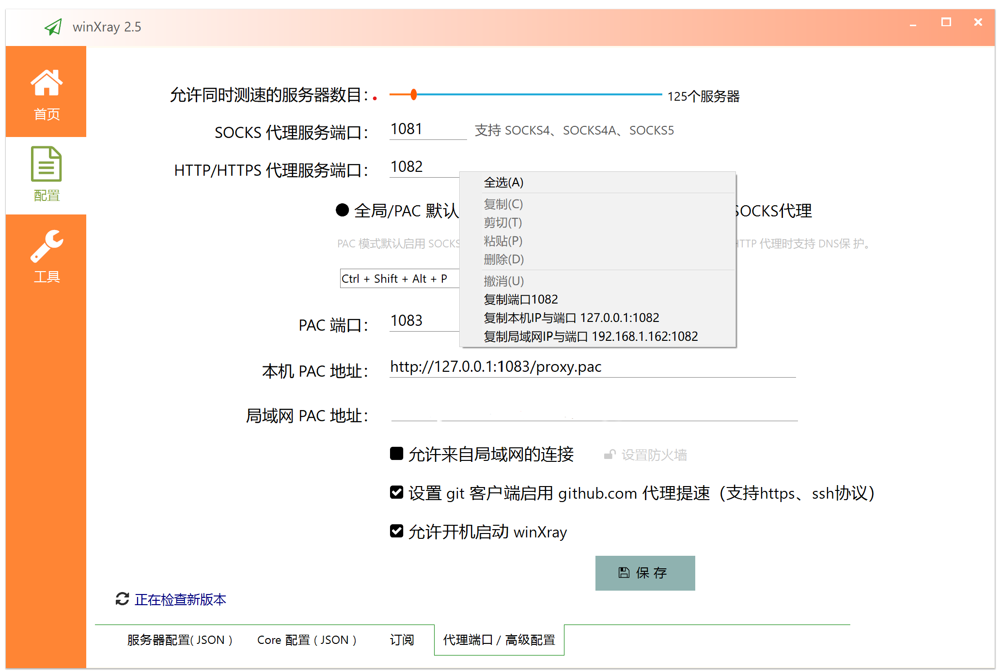
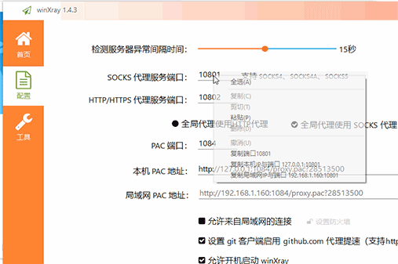


      WinXray V4.4 修复托盘右键扫一扫导入节点报错！
      

导语：
     请使用用官网地址下载：https://www.winxray.com
     

  WinXray是一个支持 [Xray/V2Ray(vmess/vless/xtls)、Shadowsocks、Trojan、Trojan-go](https://github.com/XTLS/Xray-core)、SSR、NaïveProxy、 等等 网络代理的通用客户端（Windows系统），可自动检测并连接访问速度最快的代理服务器。服务器连接异常时可以自动更换代理服务器 - 再也不用担心服务器抽风了。winXray 也提供一键安装 XRay(V2Ray、Shadowsocks、Trojan) 服务器工具。

  
之前我用过很多代理客户端，经常用一会就挂掉了，有些测试很久才找到下一个可用的服务器，有时怎么切换都不行，一定要把整个软件退出重启才能恢复。而且在WIN10上都有相同的BUG:PAC代理用一段时间就会卡死( winXray已经通过自行实现PAC服务器解决了这个问题 )，其实这些软件里提供的很多功能我并不需要，我只想愉快地用下 google 找点技术资料提升工作效率。但是在网上找了很久都没找到适合的软件，于是决定自己动手写一个，还好用 aardio 写软件的速度很快 - 大概用了几个小时就完成了 winXray 的主要代码，改进了几个版本以后就很稳定了，**我自己用了 WinXray  几个月再也没有遇到 google 抽风访问不了的问题**。    

一些网友对 WinXray 的测速功能存在误解，简单的测速不但不必要的消耗流量而且没有什么实用价值，例如Ping通了TCP访问不了，TCP通了但浏览器被阻断，或者下载测速需要连接代理服务器以后长时间测试才能得到下载速度 - 如果有很多服务器需要频繁快速地测速这样显然是不行的。**根据我长时间的实测，我使用一堆的服务器，大多时候 WinXray 都能最快的找到其中速度最快、且能正常使用的线路**。要考虑到网络速度与服务器响应速度本来就是波动的，**WinXray 能在连接代理服务器以前在零点几秒以内快速地在上百个代理服务器中找出最快的服务器** - 可以节省我们大量手动测试切换的时间，如果你有一个比我们幸福的网络环境，有一堆稳定流畅看4K视频的代理服务器 - 那你确实可以关闭自动切换功能 - 手动切换即可。

WinXray支持批量导入 vless、vmess、ss、trojan、trojan-go …… 等格式的分享链接，  
也可以导入v2ray,、Shadowsocks、trojan等通用订阅链接，兼容 base 64、json …… 等不同格式的服务器配置，也可以导入 Clash proxy-provider 配置，winXray将自动转化各种不兼容的配置为统一、规范的格式。winXray 有强大的兼容性，我们甚至可以直接自 github 项目地址导入代理服务器!

**小技巧: JSON里点击任意字段都会显示该字段的用法说明。** 个人认为做很多对话框来配置服务器的参数是非常蠢的，winXray已经把各种代理协议的配置简化为几个统一命名的JSON字段（ **也可以作为一种标准的、统一的、通用的订阅响应格式使用** ），只要稍加学习就可以非常熟练的添加、修改各种代理协议的配置。而且对于大多数用户根本不需要改配置 - 简单的复制导入分享链接就可以，我们不必要把简单的事搞复杂。

可选在 ["/xray-core/winXray-default-servers.json"](./xray-core/winXray-default-servers.json) 文件中添加默认服务器配置（生成EXE后默认配置自动嵌入到EXE文件，可选删除该文件,也可以继续使用该文件覆盖EXE自带的默认服务器列表）。

**小技巧: PAC编辑器里点击任意域名都会自动关联到单选框，可以直接切换代理或直连。**

软件首次运行时会在当前目录查找 "./xray-core/xray.exe"   
发行文件仅需要 "./winXray.exe"，可选带上 "./xray-core/" 目录（ 如果没有找到会自动到v2ray官网下载，不过没有代理服务器下载有时候非常慢 )。

局域网同理，苹果手机，安卓手机都可以添加代理实现！

