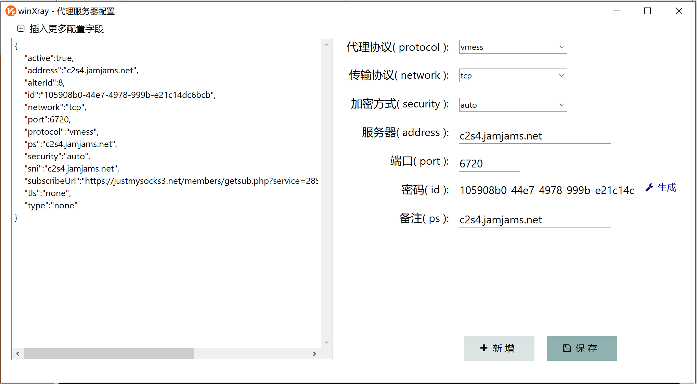

# winXray 小技巧

### 一、批量导入链接技巧

winXray 可通过【批量导入链接】功能导入以下格式的分享链接、订阅源、或JSON配置：

    1、一行或多行（忽略无效行）分享链接或服务器JSON配置。  
    支持 vmess://，vless://，ss://，ssr://，trojan://， trojan-go://，native+http://，socks://  等通用分享链接。  

    2、包含多个服务器配置的JSON数组,支持winXray格式以及通用格式JSON。  

    3、单个 http:// 或 https:// 开头的通用订阅源地址。  
    可直接使用浏览器地址栏的github文件地址（含blob或raw目录名）。  
    也可以仅复制单斜杆开始的github文件路径。  

    订阅源可用BASE64编码或明文返回以上1、2条规定的配置或分享链接。

[网络免费 vmess 服务器订阅链接](https://proxypool.ga/vmess/sub)   
[网络免费 Shadowsocks 服务器订阅链接](https://proxypool.ga/ss/sub)     
[网络免费 clash 服务器订阅链接](https://proxypoolss.tk/clash/proxies?speed=100&type=vmess,trojan)   

可复制上面各种格式订阅链接，在 winXray 中点击【批量导入链接】体验 winXray 有强大的兼容性。

支持以下格式的 Github 项目文件地址作为订阅源( 可省略域名并以斜杆开头 ）：  
https://github.com/winXray/winXray/blob/master/sub/sample.json  
[/winXray/blob/master/sub/sample.json](./sample.json)  
https://github.com/winXray/winXray/raw/master/sub/sample.json  
[/winXray/winXray/raw/master/sub/sample.json](./sample.json)  
https://raw.githubusercontent.com/winXray/winXray/master/sub/sample.json  

###  二、使用新增、编辑服务器配置的对话框

winXray 新版已经添加了新增、编辑服务器配置的对话框，请直接在 winXray 首页服务器列表点右键菜单，然后点【新增、编辑代理服务器】即可。

###  三、使用JSON配置服务器

JSON配置界面里点击任意字段都会显示该字段的用法说明。个人认为做很多对话框来配置服务器的参数其实是把简单的事搞复杂了，winXray已经把各种代理协议的配置简化为几个统一命名的JSON字段（ **也可以作为一种标准的、统一的、通用的订阅响应格式使用** ），只要稍加学习就可以非常熟练的添加、修改各种代理协议的配置。而且对于大多数用户根本不需要改配置 - 简单的复制导入分享链接就可以，我们不必要把简单的事搞复杂。

###  四、使用 PAC 编辑器
可以直接复制网址（ 不需要去截取域名 ） ，然后打开 PAC 编辑器，这时候 winXray 会自动从剪贴板把域名取出来并且输入好，只要点一下设为代理，然后添加域名就可以了。也可以一次复制多个域名，域名可以任何空白字符（或者换行）分隔，然后点右键菜单，再点批量导入域名即可。

winXray 里的 PAC 支持 CIDR 格式的 IP 地址段, 使用此功能可以轻松的让 PAC 代理支持 Telegram。

###  五、Telegram 代理设置
有很多软件的 PAC 代理不支持 Telegram，但 winXray 的 PAC 代理有良好的兼容性 - 可以完美支持 Telegram IP 地址库（ 旧版本升级请在 PAC 编辑器右键添加 Telegram IP 地址库 ） 。

当然我们也可以直接告诉 Telegram 他要使用的代理服务器地址的操作非常简单，请看下面的动画：

